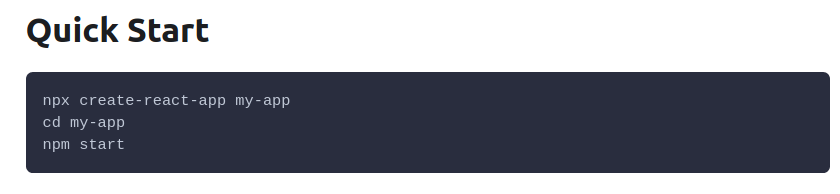

### Pomocne linki przy instalacji narzędzi
  * [instalacja NodeJS](https://aimweb.pl/jak-zainstalowac-nodejs-i-npm/),
  * sprawdzenie poprawności instalacji za pomocą komend ```node -v``` i ```npm -v```,
  * [instalacja 'create-react-app'](https://pl.reactjs.org/docs/create-a-new-react-app.html#create-react-app), na stronie są również inne 'zestawy narzędziowe', np. [Gatsby](https://pl.reactjs.org/docs/create-a-new-react-app.html#gatsby),  
  * [najświeższa wersja dokumentacji 'create-react-app'](https://github.com/facebook/create-react-app/blob/master/packages/cra-template/template/README.md),  

### Porady i informacje
  * do pliku .gitignore dobrze jest dodać linię ```node_modules/```, żeby nie wysyłacć na repo niepotrzebnych plików o sporej wadze,
  * w gałęzi [main] naszego repozytorium znajduje się wersja końcowa aplikacji, poszczególne etapy budowy aplikacji znajdują się w gałęziach postaci ```cra/numer_zagadnienia - nazwa_zagadnienia```


### Dokumentacja
  * główne [koncepcje](https://reactjs.org/docs/hello-world.html) w React.js,
  * praca z narzędziem [create-react-app](https://create-react-app.dev/docs/getting-started)

### Zagadnienia
  * instalacja pakietu create-react-app
    
   * tworzenia aplikacja za pomocą create-react-app
    
  * next