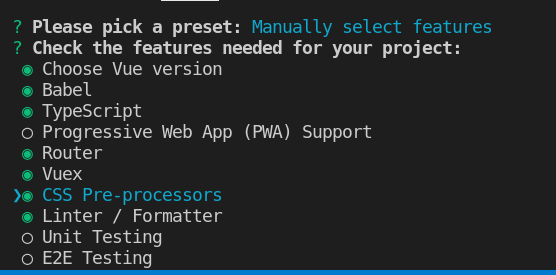
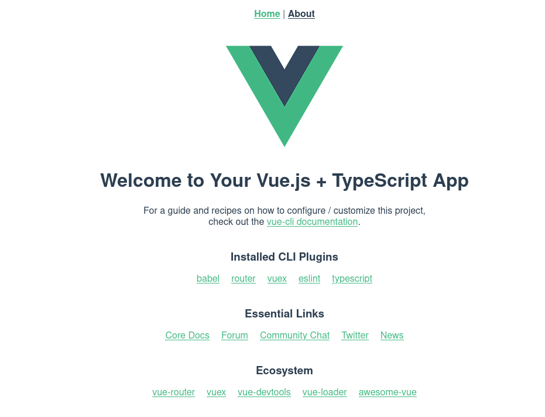

#### Projekt startowy wykorzystujący `vue-cli`
- bazuje na tutorialu z [Digital Ocean](https://www.digitalocean.com/community/tutorials/how-to-generate-a-vue-js-single-page-app-with-vue-create),  
- konieczny zainstalowany node.js (wraz z npm),  
- instalacja `vue-cli`, np. `npm i -g @vue/cli` (mogą być wymagane uprawnienia administratora!),  

##### Nowy projekt
- utworzenie nowego projektu: `vue create vue-starter-project`,  
- wybieramy opcje zaznaczone na rysunku (zaznaczamy spacją, a na koniec wciskamy 'Enter'):  
 
- wybieramy wersję Vue 3,  
- nie wybieramy klasowej składni komponentów,  
- wybieramy użycie kompilatora [Babel](https://babeljs.io/),  
- wybieramy użycie [history mode](https://router.vuejs.org/guide/essentials/history-mode.html#example-server-configurations) dla routera,  
- po wybraniu 'Sass/SCSS (with node-sass)' jako preprocesora CSS pojawiły się błędy, opisane [tutaj](https://stackoverflow.com/questions/45801457/node-js-python-not-found-exception-due-to-node-sass-and-node-gyp),  
- można sprawdzić u siebie i jeśli zadziała, to można pracować dalej z wybranymi ustawieniami,  
- wybrałem 'Less' jako preprocesor CSS i zadziałało ...,  
- jako styl linter'a wybieramy 'ESLint + Standard config' oraz opcję 'Lint on save',  
- wybieramy dedykowane pliki do przechowywania konfiguracji,  
- możemy zachować nasze ustawienia pod określoną nazwą, jeśli chcemy (przyda się przy kolejnym projekcie),  
- wchodzimy do folderu z projektem `cd vue-starter-project` i uruchamiamy go: `npm run serve`,  
- powinna się uruchomić strona startowa projektu z informacją o konfiguracji, którą wybraliśmy:  

- dla każdej wybranej "usługi" (Babel, TypeScript i ESLint) został utworzony osobny plik konfiguracyjny,  

###### Komponenty
- tworzymy plik `AppHeader.vue` w folderze 'src' z kodem nowego komponentu dla nagłówka,  
- tworzymy plik `AppFooter.vue` w folderze 'src' z kodem nowego komponentu dla stopki,  
